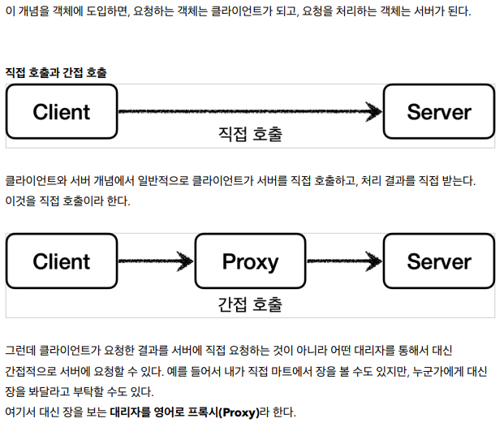

# 예제 프로젝트 V1


## V1 - 인터페이스와 구현 클래스 - 스프링 빈으로 등록

`@Configuration` 자동 대상이 되지 않도록 하기위해서 별도의 패키지 등록

```java
    @SpringBootApplication(scanBasePackages = "hello.proxy.app")
    public class MainApplication {
        
    }
```

# 프록시 란 무엇인가? 


1. 클라이언트는 `서버에 필요한 것을 요청` 서버는 `클라이언트의 요청을 처리` 한다.
2. 객체에서 프록시가 되려면, 클라이언트는 서버에게 요청을 한 것인지 `proxy`에 요청한 것인지 알 수 없어야한다.

## 프록시의 주요 기능
프록시를 통해서 할 수 있는 일은 크게 2가지로 구분할 수 있다.
- 접근 제어
  - 권한에 따른 접근 차단
  - 캐싱
  - 지연 로딩
- 부가 기능 추가
  - 원래 서버가 제공하는 기능에 더해서 부가 기능을 수행한다.
  - 예) 요청 값이나, 응답 값을 중간에 변형한다.
  - 예) 실행 시간을 측정해서 추가 로그를 남긴다. 

프록시 객체가 중간에 있으면 크게 `접근 제어와 부가 기능 추가`를 수행할 수 있다



### [예시]

1. 캐싱 
엄마에게 라면을 사달라고 부탁(요청) 
엄마는 그 라면은 이미 집에 있다고 할 수도 있다.(접근 제어, 캐싱)


2. 아버지께 자동차 주유를 부탁(요청)
아버지가 주유 뿐만 아니라 세차까지 하고 왔다.   
클라이언트가 기대한 것 외에 세차라는 부가 기능까지 얻게 되었다. (부가 기능 추가)    
그리고 대리자가 또 다른 대리자를 부를 수도 있다.


3. 예를 들어서 내가 동생에게 라면을 사달라고 했는데,   
동생은 `또 다른 누군가에게` 라면을 사달라고 다시 요청할 수도 있다.    
중요한 점은 클라이언트는 대리자를 통해서 요청했기 때문에 그 `이후 과정은 모른다는 점`이다. 동생을 통해서 라면이 나에게 도착하기만 하면
된다. 

### 프록시 체인


프록시패턴 -> 접근제어가 목적    
데코레이터 패턴 -> 새로운 기능 추가 


# 실습 
## 프록시 패턴 적용전 클래스 의존 관계 


## 정리 
1. 인터페이스 기반과 구체 클래스기반으로 프록시를 적용할 수 있다.
2. `프록시가 빈`의 대상이 되는 것은 프록시로 감싸진 대상이 `프록시로 감싸져야한다는 것을 명시`할 수 있다. 

| 대상 |설명|   용도   |
|:---:|:---:|:------:|
|프록시 패턴| 접근제어가 목적| 보안, 캐싱 |
|데코레이터| 새로운 기능을 추가|


### 클래스 기반 프록시는 상속을 사용하기 때문에 몇가지 제약이 있다.
부모 클래스의 생성자를 호출해야 한다.(앞서 본 예제)
클래스에 final 키워드가 붙으면 상속이 불가능하다.
메서드에 final 키워드가 붙으면 해당 메서드를 오버라이딩 할 수 없다


# 동적 프록시

1. JDK 동적프록시 
   - 자바에서 기본으로 제공하는 `프록시` 방법으로 `인터페이스가 필수`이다.


# 프록시팩토리 

## 문제점 
- 인터페이스가 있는 경우에는 JDK 동적 프록시를 이용하고 그렇지 않은 경우에는 CGLIB 를 적용하려면 어떻게 해야할까?
- 두 기술을 함꼐 사용할 때 부가 기능을 제공하기 위해 JDK 동적 프록시가 제공하는 InvocationHandler 와 cglib가 제공하는 `MethodInterceptor`를 각각 중복으로 만들어서 관리해야할까?


## 프록시 팩토리 구조 
 프록시 팩토리는 인터페이스 존재 유무에 따라 프록시 방법을 선택할 수 있게 해준다.
하지만, 이러한 패턴은 생성에는 이 점이 있지만 구현에서는 두가지를 동시에 만들어야하는 문제를 만들게 된다. 
이 문제를 해결하기 위해서 `ADVICE` 추상 개념을 만들게 된다.

Advice  로직 
ProxyFactory 프록시를 생성


adviceInvocationHandler 를 처음부터 붙여서 우리가 만든 ADVICE를 실행하게 되어 있다.


